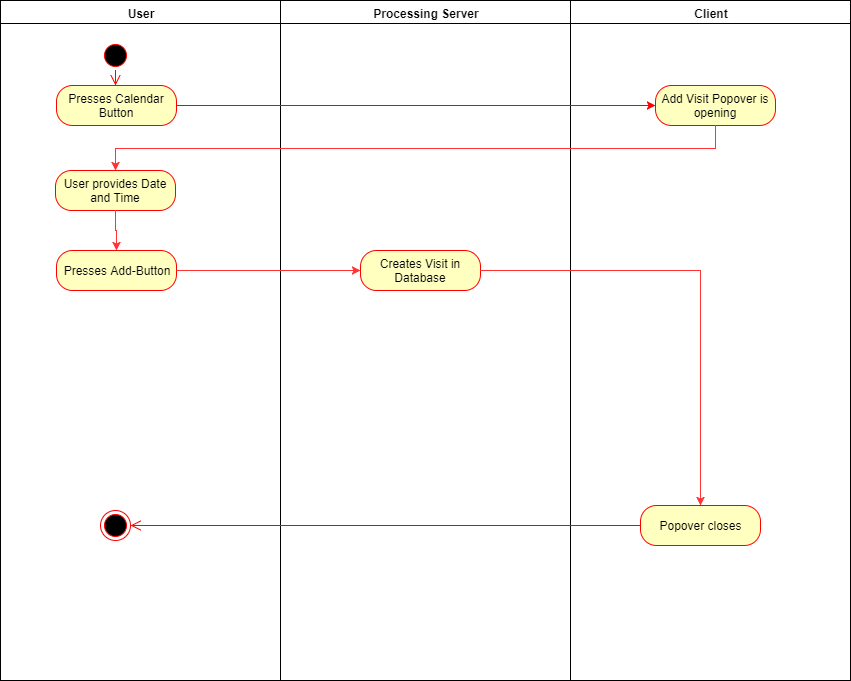

# Use-Case Document Add Visit
## Add Visit
### Brief Description
This use-case is strongly connected with the PlacesView. Everywhere you look at a place, you're able to add a visit of this place.
A Visit briefly describes the connection between a place and the time, the user was at this place. He's able to plan a Visit in the future or add an older visit. Adding a visit is also connected with searching for a place, because in most cases you will search a place an then plan a visit.
## Flow of Events
### Basic flow

### Feature-files

### Mock-Ups

## Special Requirements
n/a
## Preconditions
### Valid log-in
The User has to be signed-up and logged-in.
### Selected Place
The User has searched for and selected a Place, he wants to visit.
## Postconditions
The Visit is stored to the database and is now available in the Timeline View, where he is able to provide further information to the visit.
## Extension Points
n/a
