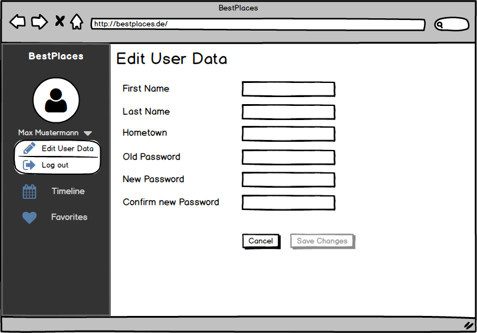
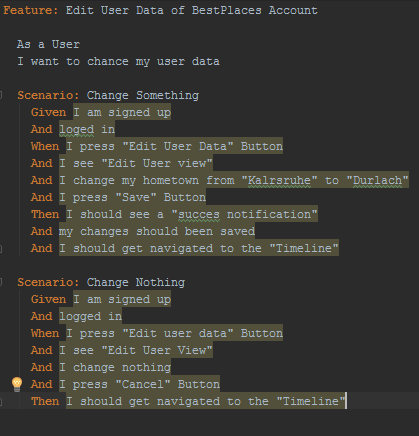

# Use-Case Specification: Edit User Data
## Sign Up
### Brief Description
This Use-Case allows the users to change his personal information like hometown, email and so on. The username
must not change because it’s a primary key in our data base.
## Flow of Events
### Basic Flow
This is the activity diagram for the use-case:

Mockup:

Feature File:

[Link to EditUserData Feature File](https://github.com/anonfreak/bestplaces-client/blob/master/src/test/features/edituserdata.feature)
### Alternative Flows
n/a
## Special Requirements
n/a
## Preconditions
### Valid log-in
The user must be signed-up and logged-in.
## Postconditions
### Save changes
The changed information of the user should be saved in our database.
### Go back to Timeline
After saving the data, the user will be navigated back to the Timeline.
## Extension Points
### Function Points
| Transaction | DET | RET | FTR | Complexity | Number of | Comment |
| ----------- | --- | --- | --- | ---------- | --------- | ------- |
| EI | 8 | 1 | 1 | low | 1 |  |
| EO | 8 | 1 | 1 | low | 1 |  |
| EQ |  |  |  |  | 0 |  |
| ILF | 8 | 1 |  | low | 1 |  |
| EIF |  |  |  |  | 0 |  |

| Function Points | Time | Estimation |
| --------------- | ---- | ---------- |
| 14,42 | 8:16 |  |
