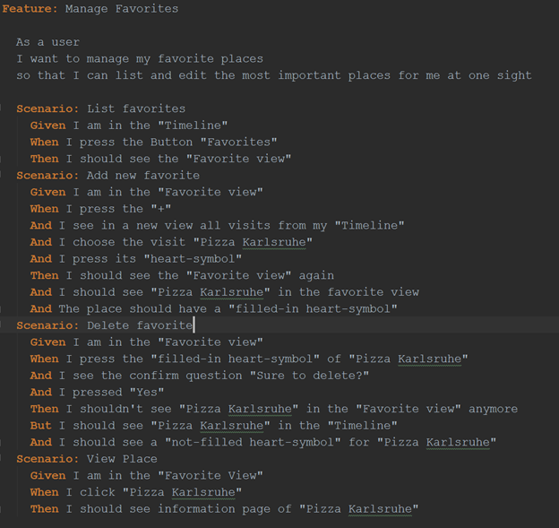
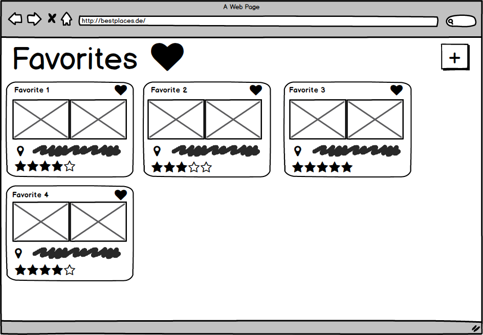
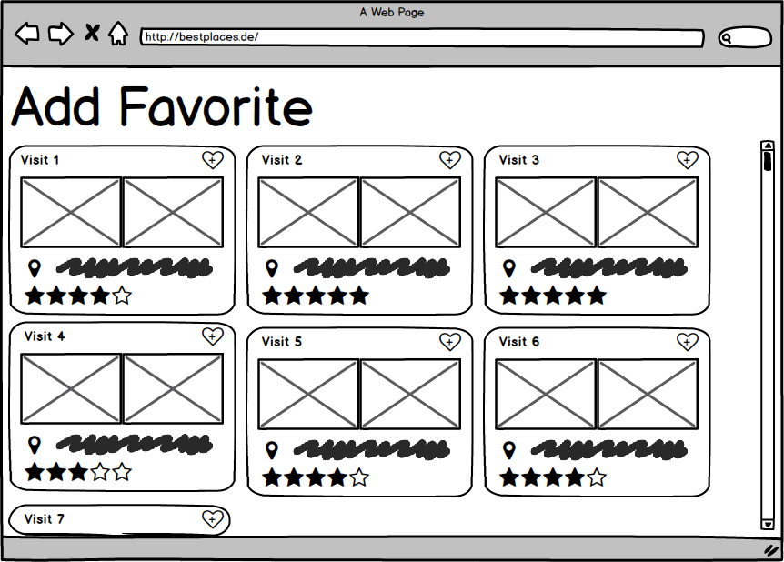
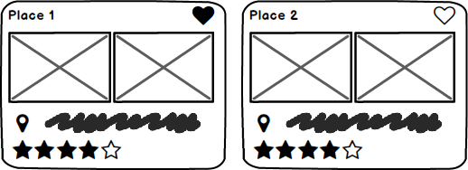

# Use-Case Specification: Manage Favorites (CRUD)
## Manage Favorites (CRUD)
### Brief Description
This Use-Case allows the users to manage his favorite places. This includes add, delete and view. Because
of that, this Use-Case is a CRUD.
## Flow of Events
### Basic Flow

This is an Activity Diagram showing how the different parts of Manage Favorites stick together. The single diagrams of the Use Cases will follow later. M1 etc. stands for the corresponding Mock-up to the Use Case.

The feature file, which goes with the CRUD for managing favorites.
[Link to Favorite Feature File](https://github.com/anonfreak/bestplaces-client/blob/master/src/test/features/excluded/favorites.feature)

Mock-up (M1) showing the Favorite View. To add a visit, press the ‘+’. To delete a favorite, press the heart.

Mock-up (M2) showing the add feature. To select a visit, press the heart-symbol.

Mock-up showing two places. Place one is a favorite. Place two not.

### Alternative Flows
n/a
## Special Requirements
n/a
## Preconditions
### Valid log-in
The user must be signed-up and logged-in. Furthermore, he needs to have at least one visit in his timeline to be able to select one as favorite. To delete a favorite, there must be, of course, at least one favorite to delete one.
### Existing Visits
Furthermore, he needs to have at least one visit in his timeline to be able to select one as favorite. To delete a favorite, there must be, of course, at least one favorite to delete one.
## Postconditions
### Add Favorite
If the user adds a Favorite, the visit will appear in the favorite view. Also, the visit gets a filled-in heart-symbol in the timeline to show it’s a favorite.
### Delete Favorite
If the user deletes a favorite, it will disappear in the favorite view. The heart-symbol in the timeline change to a not filled-in heart-symbol.
## Extension Points
n/a
