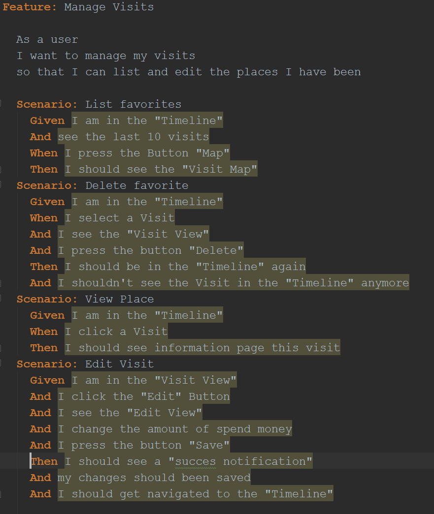
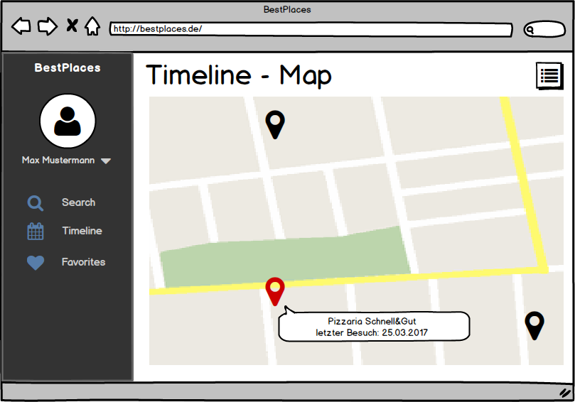
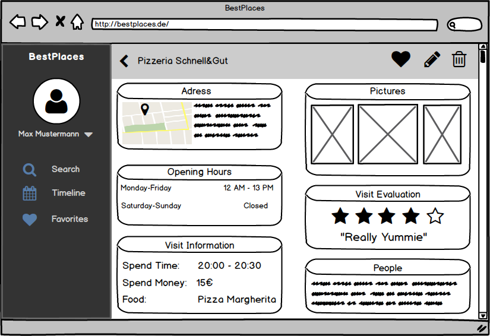

# Use-Case Specification: Manage Visits (CRUD)
## Manage Visits (CRUD)
### Brief Description
This Use-Case allows the users to manage his visits. This includes add, delete, edit and view. Because
of that, this Use-Case is a CRUD.
## Flow of Events
### Basic Flow
  
Basically this Activity Diagram is like the Diagram of Manage Favorites. It shows how the different parts
of Manage Visits stick together. The single diagrams of the Use Cases will follow later.

  
The feature file, which goes with the CRUD for managing favorites.

  
This is the first Mockup for List Visits. This is just the Timeline View, described in the use case document
“ViewTimeline”.

  
The second mockup for list visits is, to show them on a map. The user can see the map, when he clicks on the “Map
Button”. To get back to the Timeline, the user has to click on the “List Button”.

  
To add a new Visit, the user has to click the plus button in the Timeline. After that he will be passed to the Search
View, where he can search for the place and add it as a Visit. This is exactly described in the Use Case Document
“Add visit”.
When the user clicks on a visit he will see the VisitView (below), a PlacesView with more information about his
visit. Inside this view he can delete and edit this visit.
### Alternative Flows
n/a
## Special Requirements
n/a
## Preconditions
### Valid log-in
The user must be signed-up and logged-in.
## Postconditions
### Add Visit
If the user adds a Visit, the visit will appear in the Timeline.
### Delete Visit
If the user deletes a favorite, it will disappear in the Timeline.
## Extension Points
### Function Points
| Transaction | DET | RET | FTR | Complexity | Number of | Comment |
| ----------- | --- | --- | --- | ---------- | --------- | ------- |
| EI | 9 |  | 1 | low | 1 | 3Button/6Eingsbefelder bei bearbeiten |
| EO | 6 |  | 1 | low | 2 |  |
| EQ |  |  |  |  | 0 |  |
| ILF | 10 | 1 |  | low | 1 |  |
| EIF | 10 | 1 |  | low | 1 |  |

| Function Points | Time | Estimation |
| --------------- | ---- | ---------- |
| 23,69 |  | 30:22 |

