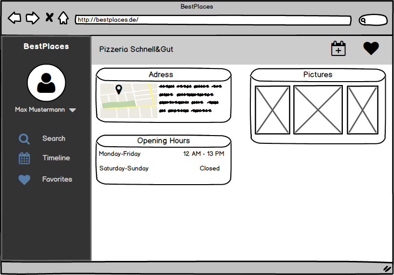

# Use-Case Document Get Information (Choose Place)
## Get Information (Choose Place)
### Brief Description
This use-case will be used in multiple Use-Cases, which will follow and is a major part of the Places crud.
Therefore it's the second most import part of our application, right after the Timeline. It's used to display and edit Information on Places. That's why it is needed everywhere, you can display Places and their information.
## Flow of Events
### Basic flow
### Feature-files
### Mock-Ups

## Special Requirements
## Preconditions
### Valid log-in
The User has to be signed-up and logged-in.
### Selected Place
The User has selected a Place, he wants to have more information about. In this case the user selected a place by searching for it.
## Postconditions
User goes back to the search results.
## Extension Points
From here, you're able to add a this Place to a visit or add it to you Favorites. These features will be described in the "Add Visit/Favorite" UseCase-Document.
