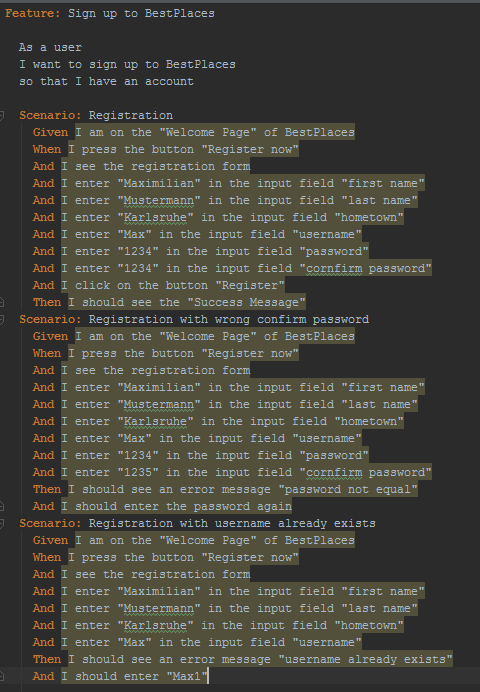
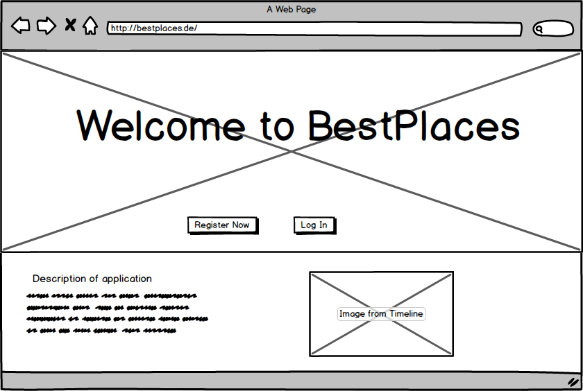
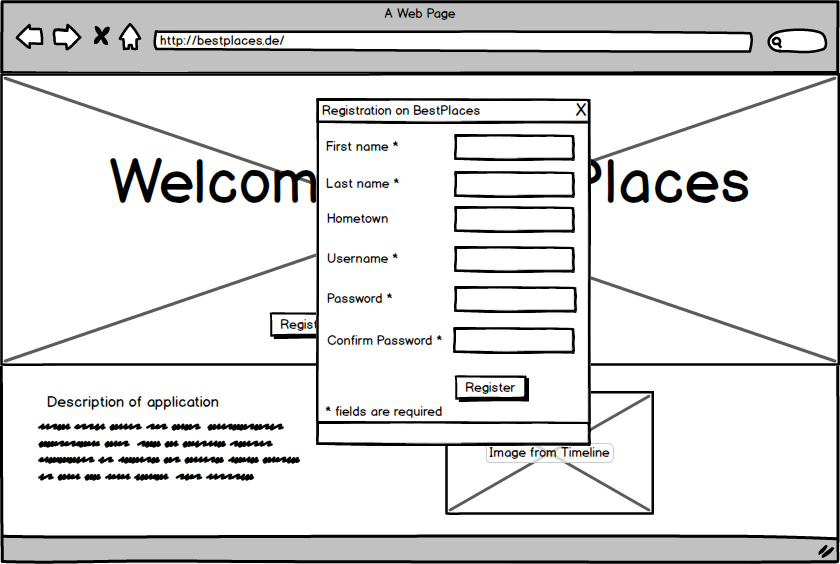
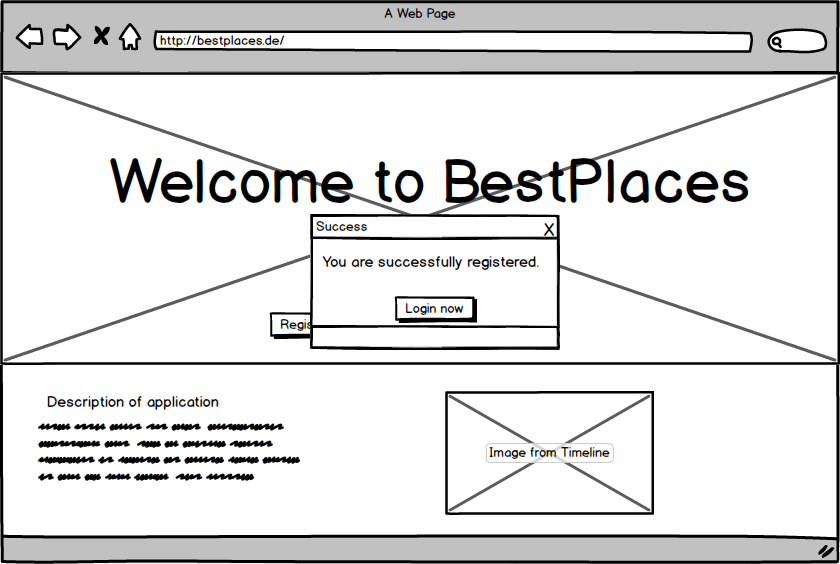

# Use-Case Specification: Sign up
## Sign Up
### Brief Description
This Use-Case allows the user to sign up to our application. Therefore, he needs to give some information like name,
username, hometown (to adapt the selection) and password.
## Flow of Events
### Basic Flow

This is the Activity Diagram showing the basic flow of this use case.
This is the feature file for this use-case:

Mockup of the Welcome page from which the user can sign up or log in:

Mockup of the register form:

Success message:

### Alternative Flows
n/a
## Special Requirements
n/a
## Preconditions
### Entering Register-Form
The user of must click on the register button of the welcome page of our application.
## Postconditions
### Save user data
After the user fill in the fields and clicked the register button, the user data must save in our database.
### Show success
If saving was successful, the user should get a message, that everything is fine.
### Go on
After the message the user should have the possibility to log in.
## Extension Points
### Function Points
| Transaction | DET | RET | FTR | Complexity | Number of | Comment |
| ----------- | --- | --- | --- | ---------- | --------- | ------- |
| EI | 8 | 1 | 1 | low | 1 |  |
| EO |  |  |  |  | 0 |  |
| EQ |  |  |  |  | 0 |  |
| ILF | 8 | 1 |  | low | 1 |  |
| EIF |  |  |  |  | 0 |  |

| Function Points | Time | Estimation |
| --------------- | ---- | ---------- |
| 10,3 | 13:10 |  |
