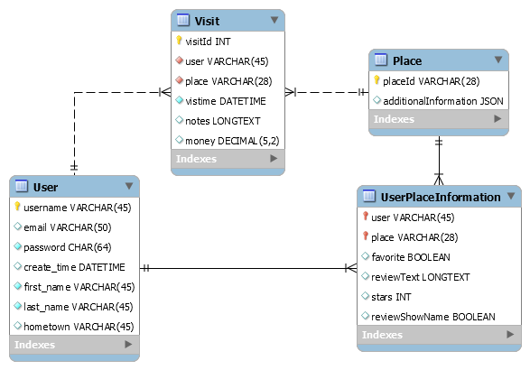

# Software Architecture Document
## Introduction
### Purpose
This document provides an overview on the architecture of our system, including several architectural views.
It is used to describe our architecture in detail and explain it in a comprehensive way.
### Scope
The scope is to show and explain the architecture of BestPlaces, as well as the server-client structure. Therefore,
we provide class-diagramms, the use-case and the actutal flow of events.
### Definitions, Acronyms and Abbreviations
### References
[API-Documentation](http://docs.bestplaces.apiary.io/)
### Overview
## Architectural Representation
As descriped in several documents and blog posts, we will use a server-client-structure, which provides clean seperation of data ware house (model), bussiness logic (Controller) and the actual Client application (View). We will use MVC in both parts of our applications to provide easy customization, as well as future-ready implementation for other clients.
## Architectural Goals and Constraints
In general we have 3 MVC-Patterns, started with server-client separation, server containing the models and the controllers and the client beeing the view for this data. For each of them we will also use a more particular MVC-Pattern, as described in the following paragraphs.
### Server-side
The server-side includes the database-management/data-warehouse (MySQL),  gathering of information from APIs, like Google Places API and the whole bussiness-logic.
Because it's written in python, we use the Django-Framework in combination with the Django-REST-Framework. First this offers pre-defined seperation of models, controllers and views and secondly we're able to provide a modern interface for client through a REST API.
Moreover, it's offering seperation of different models we need to communicate with our database, the Google Place API, as well as our own (combined) models used for output on the REST API. The REST API, presented to the client itself is a view, which is defined in Django, as it returns a JSON-"View".
### Client-side
On the client side, which will be written in Java, we do not need heavy frameworks, like Spring, to implement a MVC-pattern, because there isn't that much logic or database communication. Nevertheless, we will user selfmade-MVC to distinguish between gathering data from the server by using a RESTful-Client from temporary local data storage (models) and the actual view.
## Use-Case View
### Favorite
To better understand our models and why we have so many of them for the same purpose, let's have a look at the Favorite-use-case.
As described in the use-case documentation, favorites for places can be set by the user. Therefore there is a user-place relationship in the database. Because we always want to pull latest information from Google Places API, we have to get the place-information from the Google Places API, using an API-call. This returns a JSON of many informations, which will be reduced and fitted into our smaller model. After that we need to determine, there's no different information provided by our user in our MySQL-Database, which corrected this data. If so they will be merged and send to the client as a list of places.
The client itself has to map this JSON-models on Java-models to present them. Therefore we use jackson as an object-mapper, which simplifys and automates this process.
## Logical View
### Overview
As descriped above, we're having several MVC-patterns. The most important and most effective one is the MVC-Pattern of the server, because the whole magic happens there. Below you can see the class-diagram of our django-based server. The marked regions emphasize the models, controllers and views.

### Architecturally Significant Design Packages
## Process View
### ODOD process
ODOD means on-demand-own-data, which is used to keep our database as small as possible. To gather live information on a place, we will use the Google Places API, but if a user is able to provide better or current information, we will store that locally, until Google updated their place-information. This way we always provide most current data, while keeping our data storage consumption low.
## Deployment View
Our application will be deployed on a self-hosted linux-server, which provides full control over our application to track bugs and to keep data safe on our servers.
### Server
The server will be deployed as a django-aplication, which mainly contains all python-scripts pushed to GitHub. Our server listens for changes on the master branch of the server repository and if there is a change, it will automatically clone the repository and run the server.
Everybody on the web is able to communicate with our API, by following our API-Description. Nevertheless, you need user credentials to use the API. This ensures that user data is safe.
### Client
The Client is deployed as a war-file to our self-hosted Apache Tomcat server. To deploy to this server, there is an easy maven script in the IntelliJ-IDE, which directly builds, pushs and deploys the war to the server and immideiatly run it there.
## Implementation View
As descriped above we will use a server-client structure, which is implemented in different ways. To know more about it just read the explaination at the top.
## Data View
For the MySQL-database we tried to keep it as small as possible by merging several aspects together in one model. In the following diagramm, you're able to see all our models in the database:

## Size and Performance
The size of the project itself isn't important, as it runs on a server, which provides lots of data storage and the user hasn't do download anything. Concerning the database, we are not able to provide a big-data like data storage on places, because this is way too expensive and slows down the whole application.
Nevertheless, due to the fact that the server is located in Frankfurt data center, it should provide fast access time for europe and west-usa. Moreover, requests to Google Places API should be fast, as Google provides a great and fast infrastructure all over the world.
Because of the fact, we use a fix linux-server we're not scalable at all and we're able to handle as many users as resource available.
## Quality
