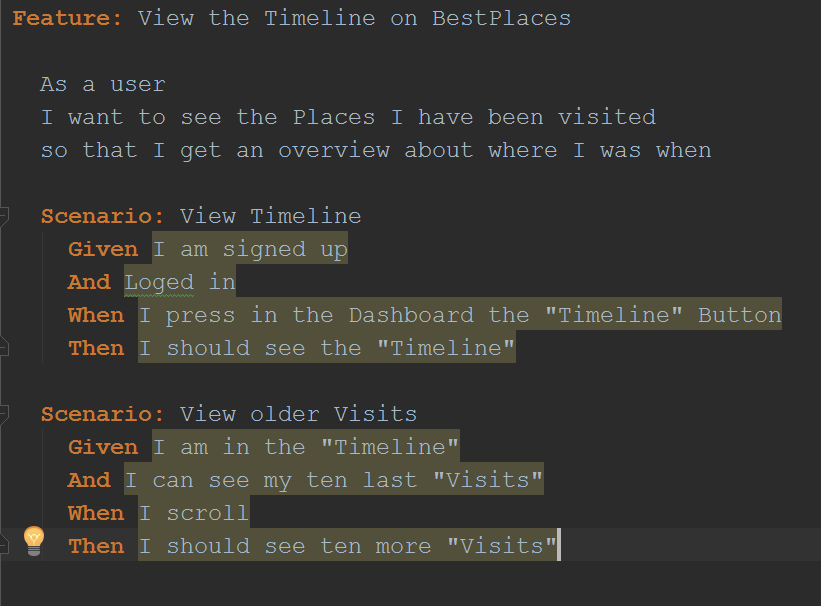
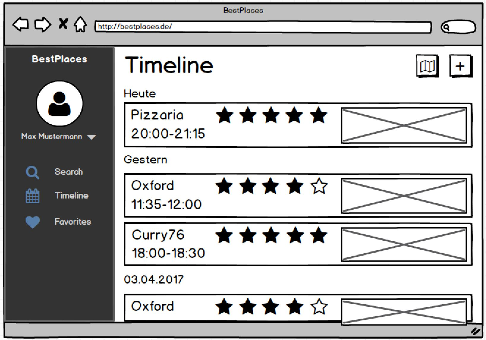

# Use-Case Specification: View Timeline
## View Timeline
### Brief Description
This Use-Case allows the users to see the last 10 places they had visited. Of course it is possible to scroll
and see more older places.
## Flow of Events
### Basic Flow
  
This is the Activity Diagram for showing the visits in the Timeline.  

  
The feature file for “View Timeline”.  

  
This is the Mockup for the Timeline.
### Alternative Flows
n/a
## Special Requirements
n/a
## Preconditions
### Valid log-in
The user must be signed-up and logged-in.
### Existing visits
Furthermore, he needs to have at least one visit in his timeline to be able to see something.
## Postconditions
### Scrollable
If the user has more than 10 visits, he should be able to scroll and load more visits. 
## Extension Points
### Function Points
| Transaction | DET | RET | FTR | Complexity | Number of | Comment |
| ----------- | --- | --- | --- | ---------- | --------- | ------- |
| EI |  |  |  |  | 0 |  |
| EO |  |  |  |  | 0 |  |
| EQ | 2 |  | 2 | low | 1 | daten lesen/anzeigen |
| ILF | 10 | 1 |  | low | 1 | visit daten |
| EIF | 10 | 1 |  | low | 1 | google daten |

| Function Points | Time | Estimation |
| --------------- | ---- | ---------- |
| 15,45 |  | 17:49 |
