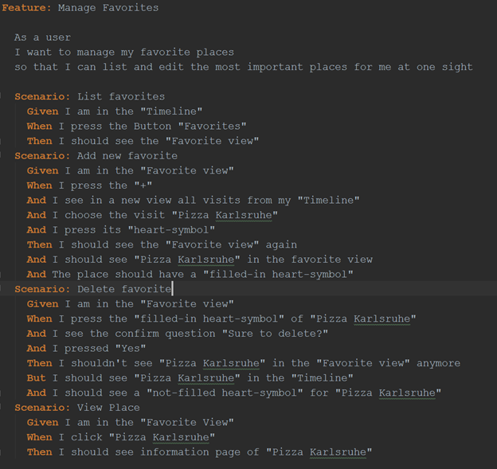
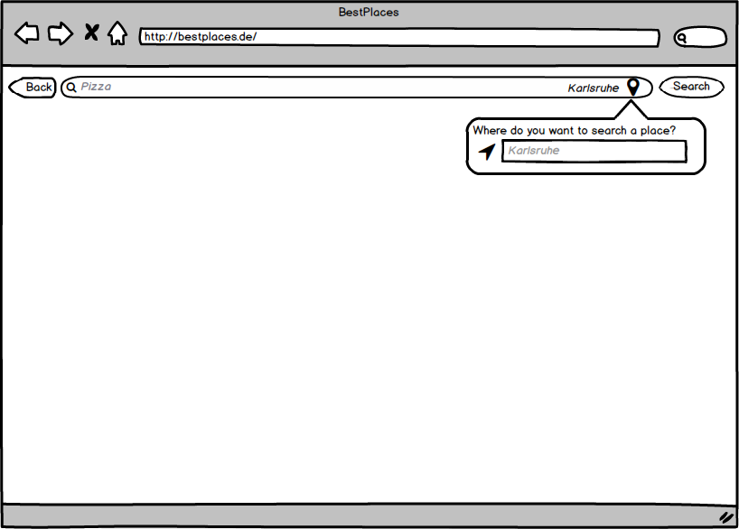
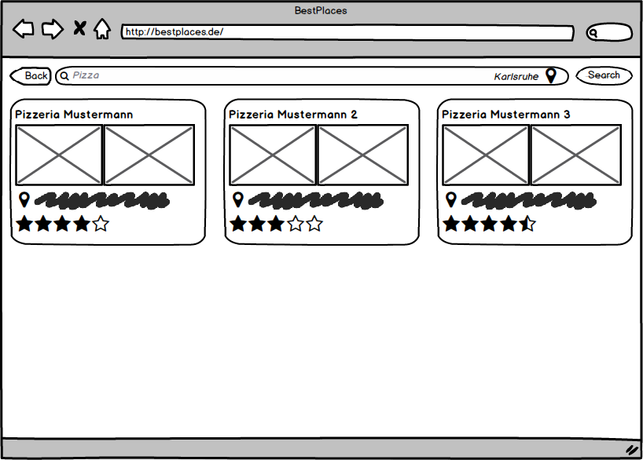

# Use-Case Specification: Searching
## Searching
### Brief Description
This use-case will enable the user to search for places. Therefore, he will be able to type the name of a place, he is
looking for into the search field. After typing and issuing enter, the result should be presented. In the end the user is
able to select a result to get further information about that place.
## Flow of Events
### Basic Flow
  
This is the Activity Diagram for this Use-Case.  

  
The feature file for “View Timeline”.  

  
Mock-up showing the search and the location edit feature.

  
Mock-up showing the results of a search.
### Alternative Flows
n/a
## Special Requirements
### Location Service
There are several ways of gathering the current location of the user. Besides the well-known GPS, we can also
gather the location by using Wi-fi or cellular location. To have the best results, GPS should be used in first place, if
the user enabled this on his device and granted access to geolocation for our service.
## Preconditions
### Valid log-in
The user must be signed-up and logged-in.
## Postconditions
### Select Results
If the user found the place, he is searching for, he will be able to select it and get more information about it.
### Dismiss
If the user didn’t found his place by searching, the result list will disappear and the timeline is shown. From there he
will be able to add his place to the database.
## Extension Points
### Function Points
| Transaction | DET | RET | FTR | Complexity | Number of | Comment |
| ----------- | --- | --- | --- | ---------- | --------- | ------- |
| EI |  |  |  |  | 0 |  |
| EO |  |  |  |  | 0 |  |
| EQ | 25 | 1 | 1 | avg | 1 | 20 Ergebnisse, 5 Eingabefelder |
| ILF |  |  |  |  | 0 |  |
| EIF | 10 | 1 |  | low | 1 | Google Response max. 10 results |

| Function Points | Time | Estimation |
| --------------- | ---- | ---------- |
| 9,42 |  | 8:37 |
